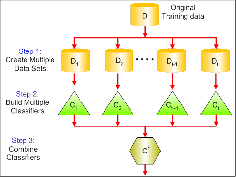

# Ensemble Decision Trees

<br>
- [Ensemble Decision Trees](#ensemble-decision-trees)
  - [1. What are ensemble methods in tree based modeling ?](#1-what-are-ensemble-methods-in-tree-based-modeling)
    - [2. What is Bagging? How does it work?](#2-what-is-bagging-how-does-it-work)
  - [3. What is Random Forest ? How does it work?](#3-what-is-random-forest--how-does-it-work)
    - [How it works?](#how-it-works)
    - [Advantages of Random Forest](#advantages-of-random-forest)
    - [Disadvantages of Random Forest](#disadvantages-of-random-forest)
    - [Python implementation](#python-implementation)
    - [R Code implementation](#r-code-implementation)
  - [4. What is Boosting ? How does it work?](#4-what-is-boosting--how-does-it-work)
    - [How does it work?](#how-does-it-work)

## 1. What are ensemble methods in tree based modeling ?
Ensemble methods involve group of predictive models to achieve a better accuracy and model stability. Ensemble methods are known to impart supreme boost to tree based models.

Some of the commonly used ensemble methods include: Bagging, Boosting and Stacking.

### 2. What is Bagging? How does it work?

Bagging is a technique used to reduce the variance of our predictions by combining the result of multiple classifiers modeled on different sub-samples of the same data set. The following figure will make it clearer:



The steps followed in bagging are:

1. **Create Multiple DataSets:**
Sampling is done with replacement on the original data and new datasets are formed.
The new data sets can have a fraction of the columns as well as rows, which are generally hyper-parameters in a bagging model
Taking row and column fractions less than 1 helps in making robust models, less prone to overfitting

2. **Build Multiple Classifiers:**
Classifiers are built on each data set.
Generally the same classifier is modeled on each data set and predictions are made.

3. **Combine Classifiers:**
The predictions of all the classifiers are combined using a mean, median or mode value depending on the problem at hand.
The combined values are generally more robust than a single model.

## 3. What is Random Forest ? How does it work?

Random Forest is a versatile machine learning method capable of performing both regression and classification tasks. It also undertakes dimensional reduction methods, treats missing values, outlier values and other essential steps of data exploration, and does a fairly good job. It is a type of ensemble learning method, where a group of weak models combine to form a powerful model.

### How it works?
It works in the following manner. Each tree is planted & grown as follows:

1. Assume number of cases in the training set is N. Then, sample of these N cases is taken at random but with replacement. This sample will be the training set for growing the tree.
2. If there are M input variables, a number m<M is specified such that at each node, m variables are selected at random out of the M. The best split on these m is used to split the node. The value of m is held constant while we grow the forest.
3. Each tree is grown to the largest extent possible and  there is no pruning.
4. Predict new data by aggregating the predictions of the ntree trees (i.e., majority votes for classification, average for regression).


### Advantages of Random Forest

- This algorithm can solve both type of problems i.e. classification and regression and does a decent estimation at both fronts.
- One of benefits of Random forest which excites me most is, the power of handle large data set with higher dimensionality. It can handle thousands of input variables and identify most significant variables so it is considered as one of the dimensionality reduction methods. Further, the model outputs **Importance of variable**, which can be a very handy feature (on some random data set).
- It has an effective method for estimating missing data and maintains accuracy when a large proportion of the data are missing.
- It has methods for balancing errors in data sets where classes are imbalanced.
- The capabilities of the above can be extended to unlabeled data, leading to unsupervised clustering, data views and outlier detection.
- Random Forest involves sampling of the input data with replacement called as bootstrap sampling. Here one third of the data is not used for training and can be used to testing. These are called the **out of bag samples**. Error estimated on these out of bag samples is known as out of bag error.

### Disadvantages of Random Forest

- It surely does a good job at classification but not as good as for regression problem as it does not give precise continuous nature predictions. In case of regression, it doesn’t predict beyond the range in the training data, and that they may over-fit data sets that are particularly noisy.
- Random Forest can feel like a black box approach for statistical modelers – you have very little control on what the model does. You can at best – try different parameters and random seeds!

### Python implementation

```python
#Import Library
from sklearn.ensemble import RandomForestClassifier #use RandomForestRegressor for regression problem
#Assumed you have, X (predictor) and Y (target) for training data set and x_test(predictor) of test_dataset
# Create Random Forest object
model= RandomForestClassifier(n_estimators=1000)
# Train the model using the training sets and check score
model.fit(X, y)
#Predict Output
predicted= model.predict(x_test)
```

### R Code implementation

```R
> library(randomForest)
> x <- cbind(x_train,y_train)
# Fitting model
> fit <- randomForest(Species ~ ., x,ntree=500)
> summary(fit)
#Predict Output
> predicted= predict(fit,x_test)
```

## 4. What is Boosting ? How does it work?

The term ‘Boosting’ refers to a family of algorithms which converts weak learner to strong learners.

To convert weak learner to strong learner, we’ll combine the prediction of each weak learner using methods like:

- Using average/ weighted average
- Considering prediction has higher vote

### How does it work?

To find weak rule, we apply base learning (ML) algorithms with a different distribution. Each time base learning algorithm is applied, it generates a new weak prediction rule. This is an iterative process. After many iterations, the boosting algorithm combines these weak rules into a single strong prediction rule.

For choosing the right distribution, here are the following steps:

Step 1:  The base learner takes all the distributions and assign equal weight or attention to each observation.

Step 2: If there is any prediction error caused by first base learning algorithm, then we pay higher attention to observations having prediction error. Then, we apply the next base learning algorithm.

Step 3: Iterate Step 2 till the limit of base learning algorithm is reached or higher accuracy is achieved.

Boosting pays higher focus on examples which are mis-classified or have higher errors by preceding weak rules.
